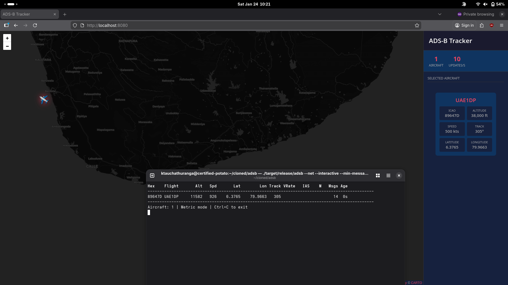

# ADS-B Decoder

A complete Rust implementation of a Mode S / ADS-B decoder for **RTL-SDR** and **HackRF One** devices. This project is a faithful port of the popular [dump1090](https://github.com/antirez/dump1090) with additional features and improvements.

[](https://www.rust-lang.org/)
[](LICENSE)
[]()
[]()



## Table of Contents

- [Overview](#overview)
- [Features](#features)
- [Installation](#installation)
- [Usage](#usage)
- [ADS-B Protocol Deep Dive](#ads-b-protocol-deep-dive)
  - [What is ADS-B?](#what-is-ads-b)
  - [Radio Frequency Characteristics](#radio-frequency-characteristics)
  - [Mode S Overview](#mode-s-overview)
  - [Signal Structure](#signal-structure)
  - [Message Structure](#message-structure)
  - [Downlink Formats (DF)](#downlink-formats-df)
  - [CRC and Error Detection](#crc-and-error-detection)
  - [ICAO Address Recovery](#icao-address-recovery)
  - [Extended Squitter (ADS-B)](#extended-squitter-ads-b)
  - [Position Encoding (CPR)](#position-encoding-cpr)
  - [Altitude Encoding](#altitude-encoding)
  - [Velocity Encoding](#velocity-encoding)
  - [Aircraft Identification](#aircraft-identification)
  - [BDS (Comm-B Data Selector)](#bds-comm-b-data-selector)
- [Architecture](#architecture)
- [Network Services](#network-services)
- [Contributing](#contributing)
- [References](#references)
- [License](#license)

---

## Overview

ADS-B (Automatic Dependent Surveillance-Broadcast) is a surveillance technology where aircraft broadcast their position, altitude, speed, and identification. This project decodes these transmissions using inexpensive SDR devices like **RTL-SDR** or **HackRF One**. 

```
┌─────────────┐     1090 MHz      ┌─────────────┐     USB      ┌─────────────┐
│  Aircraft   │ ───────────────►  │  RTL-SDR    │ ──────────►  │    adsb     │
│  Transponder│    RF Signal      │  Dongle     │   I/Q Data   │             │
└─────────────┘                   └─────────────┘              └─────────────┘
                                                                     │
                                                                     ▼
                                                         ┌─────────────────────┐
                                                         │ • Aircraft Position │
                                                         │ • Altitude          │
                                                         │ • Speed & Heading   │
                                                         │ • Flight Number     │
                                                         │ • ICAO Address      │
                                                         └─────────────────────┘
```

## Features

- **Complete Mode S Decoding**: Supports all major Downlink Formats (DF0, DF4, DF5, DF11, DF16, DF17, DF20, DF21)
- **ADS-B Extended Squitter**: Full DF17 message decoding including position, velocity, and identification
- **CPR Position Decoding**: Compact Position Reporting with global and local decoding
- **Error Correction**: Single-bit and two-bit error correction using CRC syndrome
- **Ghost Aircraft Filtering**: Persistent ICAO tracking with minimum message threshold to eliminate phantom aircraft
- **BDS Decoding**: Comm-B Data Selector registers (BDS 1,0 through 6,0) with CLI display of IAS, Mach, vertical rate
- **Emergency Squawk Alerts**: Color-coded highlighting for 7500 (hijack), 7600 (radio failure), 7700 (emergency)
- **Distance & Bearing**: Calculate distance and bearing from your receiver position to aircraft
- **Multiple Input Sources**: RTL-SDR devices, file input, network input
- **Network Output**: Raw, SBS/BaseStation, and HTTP/JSON formats
- **Interactive Display**: Real-time terminal display with BDS data, color-coded alerts, and position info
- **Web Interface**: Browser-based aircraft map visualization

## Installation

### Prerequisites

```bash
# Fedora/RHEL - RTL-SDR
sudo dnf install rtl-sdr rtl-sdr-devel

# Fedora/RHEL - HackRF
sudo dnf install hackrf

# Ubuntu/Debian - RTL-SDR
sudo apt install rtl-sdr librtlsdr-dev

# Ubuntu/Debian - HackRF
sudo apt install hackrf

# macOS
brew install librtlsdr hackrf
```

### Building

```bash
git clone https://github.com/ktauchathuranga/adsb.git
cd adsb
cargo build --release
```

### Running

```bash
# Live reception from RTL-SDR (default)
./target/release/adsb --interactive

# Live reception from HackRF One
./target/release/adsb --hackrf --interactive

# From a recorded file
./target/release/adsb --ifile recording.bin --interactive

# With network output
./target/release/adsb --net --interactive

# With your receiver position (shows distance/bearing to aircraft)
./target/release/adsb --interactive --lat 6.9271 --lon 79.8612

# Stricter ghost filtering (require 3+ messages before showing aircraft)
./target/release/adsb --interactive --min-messages 3
```

## Usage

```
adsb - Mode S decoder for RTL-SDR devices

USAGE:
    adsb [OPTIONS]

OPTIONS:
    --device-index <N>     Select RTL device (default: 0)
    --gain <db>            Set gain (default: max. Use -10 for auto-gain)
    --enable-agc           Enable Automatic Gain Control
    --freq <hz>            Set frequency (default: 1090 MHz)
    --ifile <filename>     Read data from file (use '-' for stdin)
    --loop                 With --ifile, read the same file in a loop
    --interactive          Interactive mode refreshing data on screen
    --interactive-rows <N> Max rows in interactive mode (default: 15)
    --interactive-ttl <s>  Remove aircraft if idle for <s> seconds (default: 60)
    --min-messages <N>     Minimum messages before showing aircraft (default: 2)
    --lat <degrees>        Receiver latitude for distance/bearing calculation
    --lon <degrees>        Receiver longitude for distance/bearing calculation
    --raw                  Show only messages hex values
    --net                  Enable networking
    --net-only             Enable just networking, no RTL device
    --net-ro-port <port>   TCP port for raw output (default: 30002)
    --net-ri-port <port>   TCP port for raw input (default: 30001)
    --net-http-port <port> HTTP server port (default: 8080)
    --net-sbs-port <port>  TCP port for SBS output (default: 30003)
    --no-fix               Disable single-bit error correction
    --no-crc-check         Disable CRC check
    --aggressive           More CPU for more messages (two-bit error correction)
    --metric               Use metric units - meters, km/h (default)
    --imperial             Use imperial units - feet, knots
    --help                 Show help
```

---

# ADS-B Protocol Deep Dive

## What is ADS-B?

**ADS-B** stands for **Automatic Dependent Surveillance-Broadcast**: 

| Term | Meaning |
|------|---------|
| **Automatic** | No pilot or external input required |
| **Dependent** | Depends on aircraft navigation systems (GPS) |
| **Surveillance** | Provides aircraft surveillance data |
| **Broadcast** | Transmitted to all receivers in range |

ADS-B is part of the **Mode S** (Mode Select) transponder system, which is an evolution of the older Mode A/C systems used for air traffic control.

### ADS-B vs Traditional Radar

```
Traditional Radar (Primary + Secondary):
┌─────────┐  Interrogation  ┌──────────┐
│  Radar  │ ──────────────► │ Aircraft │
│ Station │ ◄────────────── │          │
└─────────┘     Reply       └──────────┘
   (Active interrogation required)

ADS-B: 
┌──────────┐     Broadcast      ┌──────────────┐
│ Aircraft │ ──────────────────►│ Any Receiver │
└──────────┘  (No interrogation)└──────────────┘
   (Continuous autonomous broadcast)
```

## Radio Frequency Characteristics

### Frequency and Modulation

| Parameter | Value |
|-----------|-------|
| **Frequency** | 1090 MHz (1090ES - Extended Squitter) |
| **Modulation** | PPM (Pulse Position Modulation) |
| **Data Rate** | 1 Mbit/s |
| **Pulse Width** | 0.5 µs |
| **Bit Period** | 1.0 µs |
| **Transmission Power** | 125-500 Watts (aircraft) |
| **Range** | Up to 250+ nautical miles (line of sight) |

### Signal Characteristics

```
Frequency Spectrum:
                    │
        Amplitude   │      ████
                    │    ██    ██
                    │  ██        ██
                    │ █            █
                    │█              █
                    ├───────────────────► Frequency
                   1089    1090    1091 MHz
                              Center Freq
```

## Mode S Overview

Mode S is a secondary surveillance radar (SSR) system that supports:

1. **Selective Addressing**: Each aircraft has a unique 24-bit ICAO address
2. **Data Link**:  Two-way communication between ground and aircraft
3. **Extended Squitter**: Autonomous broadcasts (ADS-B)

### Mode S Message Types

```
Mode S Transponder Capabilities: 
┌─────────────────────────────────────────────────────────────┐
│                      Mode S Transponder                     │
├─────────────────────┬───────────────────────────────────────┤
│   Short Messages    │         Long Messages                 │
│   (56 bits)         │         (112 bits)                    │
├─────────────────────┼───────────────────────────────────────┤
│ • DF0  (ACAS)       │ • DF16 (Long ACAS)                    │
│ • DF4  (Altitude)   │ • DF17 (Extended Squitter/ADS-B)      │
│ • DF5  (Identity)   │ • DF18 (Extended Squitter/TIS-B)      │
│ • DF11 (All-Call)   │ • DF20 (Comm-B Altitude)              │
│                     │ • DF21 (Comm-B Identity)              │
│                     │ • DF24 (Comm-D ELM)                   │
└─────────────────────┴───────────────────────────────────────┘
```

## Signal Structure

### Preamble

Every Mode S message begins with an **8 microsecond preamble** consisting of four pulses:

```
Preamble (8 µs):
     ▲
   1 │    █   █         █   █
     │    █   █         █   █
     │    █   █         █   █
   0 └──────────────────────────────────►
          0   1   2   3   4   5   6   7 µs
          │   │         │   │
          └───┴─────────┴───┘
      Pulse positions: 0, 1, 3.5, 4.5 µs
```

**Preamble Pattern (at 2 MHz sampling = 16 samples):**

| Sample | 0 | 1 | 2 | 3 | 4 | 5 | 6 | 7 | 8 | 9 | 10| 11| 12| 13| 14| 15|
|--------|---|---|---|---|---|---|---|---|---|---|---|---|---|---|---|---|
| Level  | H | L | H | L | L | L | L | H | L | H | L | L | L | L | L | L |

### Data Bits (PPM Encoding)

Each data bit occupies **1 microsecond** and uses Pulse Position Modulation: 

```
Bit = 1:                    Bit = 0:
    ▲                           ▲
  1 │██▌                      1 │   ██▌
    │██▌                        │   ██▌
  0 │   ███                   0 │█████▌
    └──────► t                  └──────► t
    0   0.5  1 µs               0  0.5  1 µs
    
    HIGH then LOW              LOW then HIGH
```

At 2 MHz sampling rate: 
- **Bit '1'**: First sample HIGH, second sample LOW
- **Bit '0'**: First sample LOW, second sample HIGH

### Complete Message Structure

```
Short Message (56 bits = 56 µs data):
├──────────┼────────────────────────────────────────────────────┤
│ Preamble │                    Data (56 bits)                  │
│  8 µs    │                       56 µs                        │
├──────────┼────────────────────────────────────────────────────┤
                            Total: 64 µs

Long Message (112 bits = 112 µs data):
├──────────┼────────────────────────────────────────────────────────────────────────────┤
│ Preamble │                              Data (112 bits)                               │
│  8 µs    │                                 112 µs                                     │
├──────────┼────────────────────────────────────────────────────────────────────────────┤
                                      Total: 120 µs
```

## Message Structure

### Short Message Format (56 bits)

```
 DF      Other Fields                               Parity/ICAO
├──┼──────────────────────────────────────────────┼────────────┤
│5 │                    27 bits                   │   24 bits  │
├──┼──────────────────────────────────────────────┼────────────┤
└──┴──────────────────────────────────────────────┴────────────┘
  Bit 1-5:  Downlink Format
  Bit 6-32: Message content (depends on DF)
  Bit 33-56: Parity (PI) or ICAO address XOR parity
```

### Long Message Format (112 bits)

```
 DF  CA        ICAO            ME (Message/Extended Squitter)        PI
├──┼──┼──────────────┼────────────────────────────────────────┼────────────┤
│5 │3 │    24 bits   │               56 bits                  │  24 bits   │
├──┼──┼──────────────┼────────────────────────────────────────┼────────────┤
└──┴──┴──────────────┴────────────────────────────────────────┴────────────┘
  Bit 1-5:    Downlink Format (DF)
  Bit 6-8:   Capability (CA)
  Bit 9-32:  ICAO Aircraft Address (AA)
  Bit 33-88:  Message Extended (ME) / Comm-B Message (MB)
  Bit 89-112: Parity/Interrogator ID (PI)
```

### Byte Layout

```
Long Message (14 bytes):
Byte:    │  0  │  1  │  2  │  3  │  4  │  5  │  6  │  7  │  8  │  9  │ 10  │ 11  │ 12  │ 13  │
         ├─────┼─────┼─────┼─────┼─────┼─────┼─────┼─────┼─────┼─────┼─────┼─────┼─────┼─────┤
Content: │DF+CA│────── ICAO ─────│─────────────── ME (56 bits) ──────────────────│──── PI ───│
         │     │ AA1 │ AA2 │ AA3 │     │     │     │     │     │     │     │     │     │     │

Short Message (7 bytes):
Byte:    │  0  │  1  │  2  │  3  │  4  │  5  │  6  │
         ├─────┼─────┼─────┼─────┼─────┼─────┼─────┤
Content: │DF+  │──── Message ────│──── PI/ICAO ────│
         │     │                 │                 │
```

## Downlink Formats (DF)

### Overview

| DF | Name | Bits | Description | ICAO Location |
|----|------|------|-------------|---------------|
| 0 | Short Air-Air Surveillance (ACAS) | 56 | TCAS/ACAS coordination | In PI (XOR) |
| 4 | Surveillance Altitude Reply | 56 | Response to altitude interrogation | In PI (XOR) |
| 5 | Surveillance Identity Reply | 56 | Response to identity interrogation | In PI (XOR) |
| 11 | All-Call Reply | 56 | Response to all-call interrogation | In message |
| 16 | Long Air-Air Surveillance (ACAS) | 112 | Extended TCAS/ACAS | In PI (XOR) |
| 17 | Extended Squitter (ADS-B) | 112 | Automatic broadcast | In message |
| 18 | Extended Squitter (TIS-B/ADS-R) | 112 | Ground/rebroadcast | In message |
| 19 | Military Extended Squitter | 112 | Military use | In message |
| 20 | Comm-B Altitude Reply | 112 | Altitude with Comm-B data | In PI (XOR) |
| 21 | Comm-B Identity Reply | 112 | Identity with Comm-B data | In PI (XOR) |
| 24 | Comm-D (ELM) | 112 | Extended Length Message | In PI (XOR) |

### DF11:  All-Call Reply

Sent in response to all-call interrogations.  Contains the aircraft's ICAO address directly.

```
DF11 Structure (56 bits):
┌─────────┬─────┬────────────────────────┬────────────────────────┐
│  DF=11  │ CA  │      ICAO Address      │       PI (Parity)      │
│ 5 bits  │3 bit│       24 bits          │        24 bits         │
└─────────┴─────┴────────────────────────┴────────────────────────┘
    │        │            │                        │
    │        │            │                        └── CRC checksum
    │        │            └── Unique aircraft address
    │        └── Capability (transponder level)
    └── Binary:  01011

CA (Capability) Values: 
┌────┬─────────────────────────────────────────────────┐
│ CA │ Description                                     │
├────┼─────────────────────────────────────────────────┤
│ 0  │ Level 1 - Surveillance only                     │
│ 1  │ Level 2 - Comm-A/B capable                      │
│ 2  │ Level 3 - Comm-A/B/C capable                    │
│ 3  │ Level 4 - Comm-A/B/C/D capable                  │
│ 4  │ Level 2/3/4 - On ground                         │
│ 5  │ Level 2/3/4 - Airborne                          │
│ 6  │ Level 2/3/4 - Status unknown                    │
│ 7  │ Level 7 - DR≠0 or FS=2,3,4,5                    │
└────┴─────────────────────────────────────────────────┘
```

**Example:**
```
Message: 5D 4D 20 23 7A 55 A6
         │  └──────┘  └─────┘
         │    ICAO     Parity
         └── DF=11, CA=5

ICAO Address: 4D2023 (Malta registration)
Capability: 5 (Airborne)
```

### DF17: Extended Squitter (ADS-B)

The primary ADS-B message format. Contains position, velocity, identification, and other data.

```
DF17 Structure (112 bits):
┌─────────┬─────┬────────────────────────┬─────────────────────────────────────────────────────┬────────────────────────┐
│  DF=17  │ CA  │      ICAO Address      │                    ME (Extended Squitter)           │       PI (Parity)      │
│ 5 bits  │3 bit│       24 bits          │                      56 bits                        │        24 bits         │
└─────────┴─────┴────────────────────────┴─────────────────────────────────────────────────────┴────────────────────────┘
                                         │
                                         ▼
                         ┌───────────────────────────────────────────────────┐
                         │  TC  │ Subtype│          Message Data             │
                         │5 bits│ 3 bits │           48 bits                 │
                         └──────┴────────┴───────────────────────────────────┘
```

### DF4/DF20: Altitude Reply

Sent in response to altitude interrogations. 

```
DF4 Structure (56 bits):
┌─────────┬─────┬─────┬─────┬───────────────────┬────────────────────────┐
│  DF=4   │ FS  │ DR  │ UM  │  Altitude Code    │      PI/ICAO XOR       │
│ 5 bits  │3 bit│5 bit│6 bit│     13 bits       │        24 bits         │
└─────────┴─────┴─────┴─────┴───────────────────┴────────────────────────┘

DF20 Structure (112 bits) - adds 56-bit Comm-B message:
┌─────────┬─────┬─────┬─────┬───────────────────┬───────────────────────────────────────┬────────────────────────┐
│  DF=20  │ FS  │ DR  │ UM  │  Altitude Code    │            MB (Comm-B)                │      PI/ICAO XOR       │
│ 5 bits  │3 bit│5 bit│6 bit│     13 bits       │              56 bits                  │        24 bits         │
└─────────┴─────┴─────┴─────┴───────────────────┴───────────────────────────────────────┴────────────────────────┘

FS (Flight Status):
┌────┬─────────────────────────────────────────────────┐
│ FS │ Description                                     │
├────┼─────────────────────────────────────────────────┤
│ 0  │ No alert, no SPI, airborne                      │
│ 1  │ No alert, no SPI, on ground                     │
│ 2  │ Alert, no SPI, airborne                         │
│ 3  │ Alert, no SPI, on ground                        │
│ 4  │ Alert, SPI, airborne or ground                  │
│ 5  │ No alert, SPI, airborne or ground               │
│ 6  │ Reserved                                        │
│ 7  │ Not assigned                                    │
└────┴─────────────────────────────────────────────────┘
```

### DF5/DF21: Identity Reply

Sent in response to identity interrogations.  Contains the squawk code.

```
DF5 Structure (56 bits):
┌─────────┬─────┬─────┬─────┬───────────────────┬────────────────────────┐
│  DF=5   │ FS  │ DR  │ UM  │   Identity Code   │      PI/ICAO XOR       │
│ 5 bits  │3 bit│5 bit│6 bit│     13 bits       │        24 bits         │
└─────────┴─────┴─────┴─────┴───────────────────┴────────────────────────┘

Identity (Squawk) Encoding:
The 13-bit identity field encodes a 4-digit octal squawk code (0000-7777).

Bit arrangement (Gillham code):
┌───┬───┬───┬───┬───┬───┬───┬───┬───┬───┬───┬───┬───┐
│C1 │A1 │C2 │A2 │C4 │A4 │ 0 │B1 │D1 │B2 │D2 │B4 │D4 │
└───┴───┴───┴───┴───┴───┴───┴───┴───┴───┴───┴───┴───┘

Squawk digit reconstruction:
A = A4×4 + A2×2 + A1
B = B4×4 + B2×2 + B1
C = C4×4 + C2×2 + C1
D = D4×4 + D2×2 + D1
Squawk = A×1000 + B×100 + C×10 + D

Special Squawk Codes: 
┌───────┬─────────────────────────────────────────┐
│ Code  │ Meaning                                 │
├───────┼─────────────────────────────────────────┤
│ 7500  │ Hijacking                               │
│ 7600  │ Radio failure                           │
│ 7700  │ Emergency                               │
│ 1200  │ VFR (Visual Flight Rules) - US          │
│ 2000  │ Default/Unassigned                      │
│ 7000  │ VFR - Europe                            │
└───────┴─────────────────────────────────────────┘
```

## CRC and Error Detection

### CRC-24 Algorithm

Mode S uses a 24-bit CRC (Cyclic Redundancy Check) for error detection. 

**Generator Polynomial:**
```
G(x) = x²⁴ + x²³ + x²² + x²¹ + x²⁰ + x¹⁹ + x¹⁸ + x¹⁷ + 
       x¹⁶ + x¹⁵ + x¹⁴ + x¹³ + x¹² + x¹⁰ + x³ + 1

Hexadecimal: 0x1FFF409
Binary:  1 1111 1111 1111 0100 0000 1001
```

### CRC Calculation

```rust
// Precomputed CRC table for each bit position
const MODES_CHECKSUM_TABLE: [u32; 112] = [
    0x3935ea, 0x1c9af5, 0xf1b77e, 0x78dbbf, // bits 0-3
    0xc397db, 0x9e31e9, 0xb0e2f0, 0x587178, // bits 4-7
    // ... (112 entries total)
];

fn modes_checksum(msg: &[u8], bits: usize) -> u32 {
    let mut crc:  u32 = 0;
    let offset = if bits == 112 { 0 } else { 112 - 56 };
    
    for j in 0..bits {
        let byte = j / 8;
        let bit = j % 8;
        let bitmask = 1 << (7 - bit);
        
        if msg[byte] & bitmask != 0 {
            crc ^= MODES_CHECKSUM_TABLE[j + offset];
        }
    }
    crc
}
```

### Error Correction

The CRC can be used to correct single-bit errors: 

```
For each bit position i: 
    1. Flip bit i in the message
    2. Calculate CRC
    3. If CRC matches the received checksum, error was at position i
    4. Keep the corrected message

For aggressive mode (two-bit errors):
    For each pair of bit positions (i, j):
        1. Flip bits i and j
        2. Calculate CRC
        3. If CRC matches, errors were at positions i and j
```

## ICAO Address Recovery

### Messages with ICAO in CRC

For DF0, DF4, DF5, DF16, DF20, and DF21, the ICAO address is XORed with the CRC: 

```
Transmitted PI field = CRC ⊕ ICAO Address

To recover ICAO: 
    1. Compute CRC over the message (excluding PI field)
    2. XOR computed CRC with received PI field
    3. Result is the ICAO address

    ICAO = ComputedCRC ⊕ ReceivedPI
```

**Validation:**
Since any 24-bit value could be a valid ICAO, we must validate by:
1. Checking if the recovered ICAO has been seen in DF11/DF17 messages
2. Maintaining a cache of known ICAO addresses
3. Only accepting messages with previously-seen ICAOs

```
Known ICAO Cache:
┌─────────────────────────────────────────────────────────────┐
│ From DF11/DF17:    ICAO directly in message → Add to cach   │
│ From DF4/DF5/etc:   Recover ICAO → Check against cache      │
└─────────────────────────────────────────────────────────────┘
```

## Extended Squitter (ADS-B)

### Type Codes (TC)

The ME field in DF17 begins with a 5-bit Type Code:

```
ME Field Structure: 
┌────────────────────────────────────────────────────────────┐
│  TC   │  Subtype  │              Data                      │
│ 5 bits│  varies   │             varies                     │
└───────┴───────────┴────────────────────────────────────────┘

Type Code Assignments:
┌─────────┬─────────────────────────────────────────────────────────┐
│   TC    │ Message Type                                            │
├─────────┼─────────────────────────────────────────────────────────┤
│  1 - 4  │ Aircraft Identification and Category                    │
│  5 - 8  │ Surface Position                                        │
│  9 - 18 │ Airborne Position (Barometric Altitude)                 │
│   19    │ Airborne Velocity                                       │
│ 20 - 22 │ Airborne Position (GNSS Height)                         │
│   23    │ Reserved for Testing                                    │
│   24    │ Reserved for Surface System Status                      │
│ 25 - 27 │ Reserved                                                │
│   28    │ Aircraft Status (Emergency/Priority/TCAS RA)            │
│   29    │ Target State and Status                                 │
│   30    │ Reserved                                                │
│   31    │ Aircraft Operational Status                             │
└─────────┴─────────────────────────────────────────────────────────┘
```

### Aircraft Identification (TC 1-4)

Contains the aircraft's callsign (flight number or registration).

```
Structure:
┌───────┬─────────┬──────────────────────────────────────────────────┐
│  TC   │   EC    │              Callsign (48 bits = 8 chars)        │
│ 5 bits│  3 bits │    C1    C2    C3    C4    C5    C6    C7    C8  │
│       │         │   6b    6b    6b    6b    6b    6b    6b    6b   │
└───────┴─────────┴──────────────────────────────────────────────────┘

Character Encoding (6 bits each, ICAO alphabet):
┌───────┬────────────────────────────────────────────────────────────┐
│ Index │ 0    1-26   27-36   37-63                                  │
│ Char  │ ' '  A-Z    0-9     (reserved)                             │
└───────┴────────────────────────────────────────────────────────────┘

Aircraft Category (EC for TC=1-4):
TC=1: Reserved
TC=2: Surface Emergency Vehicle, Service Vehicle
TC=3: A0-A7 (Light to Heavy aircraft)
TC=4: B0-B7 (Glider to UAV)
```

**Example:**
```
Message: 8D 4D 20 23 20 04 D0 F4 CB 18 20 B0 EF D4
                     └─ TC=4
                        
ME = 20 04 D0 F4 CB 18 20
   = 0010 0000 | 0000 0100 | 1101 0000 | 1111 0100 | 1100 1011 | 0001 1000 | 0010 0000

TC = 00100 = 4
Character extraction:
C1 = 000000 = 0  → ' '
C2 = 001000 = 8  → 'A'+'7' = 'M'
C3 = 000011 = 3  → 'A'+'2' = 'C'
...  (continues)

Decoded: "AMC421  " (Air Malta flight 421)
```

### Airborne Position (TC 9-18)

Contains latitude, longitude, and barometric altitude using CPR encoding.

```
Structure:
┌───────┬─────┬─────┬─────────────────┬───────┬───────────────────┬───────────────────┐
│  TC   │ SS  │ SAF │    Altitude     │   T   │   CPR Latitude    │   CPR Longitude   │
│ 5 bits│2 bit│1 bit│    12 bits      │ 1 bit │     17 bits       │     17 bits       │
└───────┴─────┴─────┴─────────────────┴───────┴───────────────────┴───────────────────┘
         │     │          │               │           │                   │
         │     │          │               │           │                   └── CPR-encoded longitude
         │     │          │               │           └── CPR-encoded latitude
         │     │          │               └── Time bit (0=even, 1=odd)
         │     │          └── Encoded altitude
         │     └── Single Antenna Flag
         └── Surveillance Status

Surveillance Status (SS):
┌────┬─────────────────────────────────────────────────┐
│ SS │ Description                                     │
├────┼─────────────────────────────────────────────────┤
│ 0  │ No condition information                        │
│ 1  │ Permanent alert (emergency condition)           │
│ 2  │ Temporary alert (changed mode A identity code)  │
│ 3  │ SPI condition                                   │
└────┴─────────────────────────────────────────────────┘
```

### Airborne Velocity (TC 19)

Contains ground speed, airspeed, vertical rate, and heading.

```
TC 19 Subtypes:
┌──────────┬───────────────────────────────────────────────────────┐
│ Subtype  │ Description                                           │
├──────────┼───────────────────────────────────────────────────────┤
│    1     │ Ground speed (subsonic)                               │
│    2     │ Ground speed (supersonic)                             │
│    3     │ Airspeed (subsonic)                                   │
│    4     │ Airspeed (supersonic)                                 │
└──────────┴───────────────────────────────────────────────────────┘

Subtype 1/2 (Ground Speed):
┌───────┬─────┬─────┬─────┬─────┬─────────────┬─────────────┬─────┬─────┬───────────┬────────────┐
│  TC   │ ST  │ IC  │ IFR │ NUC │    EW Vel   │    NS Vel   │VrSrc│VrSgn│  Vert Rate│  Reserved  │
│ 5 bits│3 bit│1 bit│1 bit│3 bit│   11 bits   │   11 bits   │1 bit│1 bit│   9 bits  │   2 bits   │
└───────┴─────┴─────┴─────┴─────┴─────────────┴─────────────┴─────┴─────┴───────────┴────────────┘

Ground Speed Calculation:
- EW Direction: 1 = West, 0 = East
- NS Direction: 1 = South, 0 = North
- Velocity = sqrt(EW² + NS²) in knots
- Subtype 1: 1 knot resolution
- Subtype 2: 4 knot resolution (supersonic)

Heading Calculation:
heading = atan2(EW_velocity, NS_velocity)
(adjust for direction signs)

Vertical Rate: 
- VrSrc: 0 = Barometric, 1 = Geometric (GNSS)
- VrSgn: 0 = Up, 1 = Down
- Rate = (value - 1) × 64 ft/min
```

## Position Encoding (CPR)

### Compact Position Reporting

CPR is an ingenious encoding that represents global positions in only 17 bits for latitude and 17 bits for longitude.

```
Traditional coordinates:
  Latitude:   -90° to +90°   needs ~27 bits for 1m precision
  Longitude: -180° to +180° needs ~28 bits for 1m precision
  Total:  ~55 bits

CPR encoding:
  Latitude:   17 bits
  Longitude: 17 bits
  Total: 34 bits (38% less!)
```

### How CPR Works

CPR divides the Earth into zones and encodes position relative to zone boundaries:

```
Latitude Zones (NZ = 15 for airborne):
┌─────────────────────────────────────────────────────────────────┐
│  90°N ├─────────────────────────────────────────────────────────│
│       │  Zone 0                                                 │
│       ├─────────────────────────────────────────────────────────│
│       │  Zone 1                                                 │
│       ├─────────────────────────────────────────────────────────│
│       │  ...                                                    │
│       ├─────────────────────────────────────────────────────────│
│       │  Zone 59 (even) / Zone 58 (odd)                         │
│ -90°S ├─────────────────────────────────────────────────────────│
└─────────────────────────────────────────────────────────────────┘

Even message:  60 latitude zones (Dlat₀ = 360°/60 = 6°)
Odd message:   59 latitude zones (Dlat₁ = 360°/59 ≈ 6.1°)
```

### Decoding Algorithm

```python
# Constants
NZ = 15  # Number of geographic latitude zones
Dlat0 = 360.0 / 60  # Even message latitude zone size
Dlat1 = 360.0 / 59  # Odd message latitude zone size

def decode_cpr(lat0, lon0, lat1, lon1, most_recent_is_odd):
    """
    Decode CPR position from even (0) and odd (1) messages.
    lat0, lon0: Even message CPR values (0-131071)
    lat1, lon1: Odd message CPR values (0-131071)
    """
    # Normalize to 0-1 range
    lat0 /= 131072.0  # 2^17
    lon0 /= 131072.0
    lat1 /= 131072.0
    lon1 /= 131072.0
    
    # Calculate latitude index
    j = floor(59 * lat0 - 60 * lat1 + 0.5)
    
    # Calculate latitudes
    rlat0 = Dlat0 * (mod(j, 60) + lat0)
    rlat1 = Dlat1 * (mod(j, 59) + lat1)
    
    # Adjust for southern hemisphere
    if rlat0 >= 270:  rlat0 -= 360
    if rlat1 >= 270: rlat1 -= 360
    
    # Check latitude zone consistency
    if NL(rlat0) != NL(rlat1):
        return None  # Position crosses zone boundary, wait for new pair
    
    # Calculate longitude
    if most_recent_is_odd: 
        ni = max(NL(rlat1) - 1, 1)
        m = floor(lon0 * (NL(rlat1) - 1) - lon1 * NL(rlat1) + 0.5)
        rlon = (360.0 / ni) * (mod(m, ni) + lon1)
        rlat = rlat1
    else: 
        ni = max(NL(rlat0), 1)
        m = floor(lon0 * (NL(rlat0) - 1) - lon1 * NL(rlat0) + 0.5)
        rlon = (360.0 / ni) * (mod(m, ni) + lon0)
        rlat = rlat0
    
    # Normalize longitude
    if rlon > 180: rlon -= 360
    
    return (rlat, rlon)

def NL(lat):
    """Number of longitude zones at given latitude."""
    if abs(lat) >= 87.0: return 1
    return floor(2 * pi / acos(1 - (1-cos(pi/2/NZ)) / cos(pi/180*lat)**2))
```

### NL (Number of Longitude Zones) Lookup Table

```
┌──────────────────┬─────┐
│ Latitude Range   │ NL  │
├──────────────────┼─────┤
│ 0° - 10. 47°     │ 59  │
│ 10.47° - 14.83°  │ 58  │
│ 14.83° - 18.19°  │ 57  │
│ 18.19° - 21.03°  │ 56  │
│ ...              │ ... │
│ 84.89° - 85.76°  │ 4   │
│ 85.76° - 86.54°  │ 3   │
│ 86.54° - 87.00°  │ 2   │
│ > 87.00°         │ 1   │
└──────────────────┴─────┘
```

## Altitude Encoding

### Q-bit Encoding (25-foot resolution)

When the Q-bit is set, altitude uses simple 25-foot increments:

```
13-bit Altitude Field:
┌───┬───┬───┬───┬───┬───┬───┬───┬───┬───┬───┬───┬───┐
│M  │Q  │A1 │A2 │A4 │B1 │B2 │B4 │C1 │C2 │C4 │D2 │D4 │
└───┴───┴───┴───┴───┴───┴───┴───┴───┴───┴───┴───┴───┘
 │   │
 │   └── Q=1: 25-foot resolution
 └── M=0: Feet, M=1: Meters

When Q=1:
  N = (all bits except M and Q)
  Altitude = N × 25 - 1000 feet
  Range:  -1000 to 50,175 feet
```

### Gillham (Gray Code) Encoding (100-foot resolution)

When Q-bit is 0, altitude uses Gray code (for compatibility with Mode C):

```
Gillham Code Structure:
D2 D4 A1 A2 A4 B1 B2 B4 C1 C2 C4

The bits encode altitude in a Gray code pattern where:
- 500-foot increments encoded in D and C bits
- 100-foot increments encoded in A and B bits

Gray Code to Binary Conversion:
binary[0] = gray[0]
binary[i] = binary[i-1] XOR gray[i]

Example:
  Gray: 0011 → Binary: 0010 (decimal 2)
  Gray: 0110 → Binary: 0100 (decimal 4)
```

## Velocity Encoding

### Ground Speed (Subtype 1/2)

```
East-West Velocity:
┌─────────────────┬───────────────────────────────────────────┐
│ Direction (1b)  │ Speed (10b)                               │
├─────────────────┼───────────────────────────────────────────┤
│ 0 = East        │ 0 = no info                               │
│ 1 = West        │ 1-1023 = speed in knots + 1               │
└─────────────────┴───────────────────────────────────────────┘

North-South Velocity: 
┌─────────────────┬───────────────────────────────────────────┐
│ Direction (1b)  │ Speed (10b)                               │
├─────────────────┼───────────────────────────────────────────┤
│ 0 = North       │ 0 = no info                               │
│ 1 = South       │ 1-1023 = speed in knots + 1               │
└─────────────────┴───────────────────────────────────────────┘

Ground Speed and Track Calculation:
  Vew = (EW_value - 1) × (direction ?  -1 : 1)
  Vns = (NS_value - 1) × (direction ? -1 : 1)
  
  Ground Speed = √(Vew² + Vns²) knots
  Track Angle = atan2(Vew, Vns) degrees

Vertical Rate: 
┌─────────────────┬─────────────────┬────────────────────────────┐
│ Source (1b)     │ Sign (1b)       │ Rate (9b)                  │
├─────────────────┼─────────────────┼────────────────────────────┤
│ 0 = Barometric  │ 0 = Up          │ 0 = no info                │
│ 1 = Geometric   │ 1 = Down        │ 1-511 = (value-1)×64 ft/min│
└─────────────────┴─────────────────┴────────────────────────────┘
```

### Heading and Airspeed (Subtype 3/4)

```
┌───────┬─────┬─────────────────┬─────────────────┬───────────────────┐
│Status │ Hdg │    Heading      │   AS Type       │    Airspeed       │
│ 1 bit │1 bit│    10 bits      │    1 bit        │    10 bits        │
└───────┴─────┴─────────────────┴─────────────────┴───────────────────┘

Heading = value × (360/1024) degrees
AS Type:  0 = IAS, 1 = TAS
Airspeed = value knots (subtype 3) or value × 4 knots (subtype 4)
```

## Aircraft Identification

### Callsign Encoding

Aircraft identification uses a 64-character alphabet encoded in 6 bits per character:

```
ICAO Character Set:
Index:   0   1   2   3   4   5   6   7   8   9  10  11  12  13  14  15
Char:  ' ' 'A' 'B' 'C' 'D' 'E' 'F' 'G' 'H' 'I' 'J' 'K' 'L' 'M' 'N' 'O'

Index:  16  17  18  19  20  21  22  23  24  25  26  27  28  29  30  31
Char:   'P' 'Q' 'R' 'S' 'T' 'U' 'V' 'W' 'X' 'Y' 'Z'  ?    ?   ?   ?   ? 

Index: 32  33  34  35  36  37  38  39  40  41  42  43  44  45  46  47
Char:  ' '  ?    ?   ?   ?   ?   ?   ?   ?   ?   ?   ?   ?   ?   ?   ?

Index: 48  49  50  51  52  53  54  55  56  57  58  59  60  61  62  63
Char:  '0' '1' '2' '3' '4' '5' '6' '7' '8' '9'  ?   ?   ?   ?    ?   ? 

Decoding 8 characters from 48 bits: 
┌────────┬────────┬────────┬────────┬────────┬────────┬────────┬────────┐
│  Char1 │  Char2 │  Char3 │  Char4 │  Char5 │  Char6 │  Char7 │  Char8 │
│ 6 bits │ 6 bits │ 6 bits │ 6 bits │ 6 bits │ 6 bits │ 6 bits │ 6 bits │
└────────┴────────┴────────┴────────┴────────┴────────┴────────┴────────┘
```

## BDS (Comm-B Data Selector)

BDS registers contain additional aircraft data in DF20/DF21 messages. 

### BDS Overview

```
┌────────┬─────────────────────────────────────────────────────────────┐
│  BDS   │ Content                                                     │
├────────┼─────────────────────────────────────────────────────────────┤
│  1,0   │ Data Link Capability Report                                 │
│  2,0   │ Aircraft Identification                                     │
│  3,0   │ ACAS Active Resolution Advisory                             │
│  4,0   │ Selected Vertical Intention                                 │
│  5,0   │ Track and Turn Report                                       │
│  6,0   │ Heading and Speed Report                                    │
└────────┴─────────────────────────────────────────────────────────────┘
```

### BDS 4,0 - Selected Vertical Intention

```
┌───────────────────────────────────────────────────────────────────────────────┐
│ MCP/FCU Selected Altitude │ FMS Selected Altitude │ Baro Pressure │ Mode Bits │
│        13 bits            │       13 bits         │    12 bits    │   8 bits  │
└───────────────────────────────────────────────────────────────────────────────┘

MCP Altitude = value × 16 feet
FMS Altitude = value × 16 feet  
Baro Pressure = 800 + value × 0.1 mb
```

### BDS 5,0 - Track and Turn Report

```
┌───────────────────────────────────────────────────────────────────────────────────────┐
│ Roll Angle │ True Track │ Ground Speed │ Track Rate │ True Airspeed │
│  11 bits   │  12 bits   │   11 bits    │  11 bits   │    11 bits    │
└───────────────────────────────────────────────────────────────────────────────────────┘

Roll Angle:  ±45°/256 per LSB (signed)
True Track: 90°/512 per LSB
Ground Speed:  2 knots per LSB
Track Rate: 8°/256 per second per LSB (signed)
True Airspeed: 2 knots per LSB
```

### BDS 6,0 - Heading and Speed Report

```
┌─────────────────────────────────────────────────────────────────────────────────────────────────┐
│ Mag Heading │ Indicated Airspeed │ Mach Number │ Baro Alt Rate │ Inertial Alt Rate │
│   12 bits   │      11 bits       │   11 bits   │    11 bits    │      11 bits      │
└─────────────────────────────────────────────────────────────────────────────────────────────────┘

Magnetic Heading: 90°/512 per LSB
Indicated Airspeed: 1 knot per LSB
Mach:  0.008 per LSB (2. 048 max)
Altitude Rate: 32 ft/min per LSB (signed)
```

---

## Architecture

```
┌─────────────────────────────────────────────────────────────────────────────────┐
│                              adsb Architecture                           │
├─────────────────────────────────────────────────────────────────────────────────┤
│                                                                                 │
│   ┌─────────────┐     ┌─────────────┐     ┌─────────────┐     ┌─────────────┐   │
│   │   RTL-SDR   │     │ Demodulator │     │   Decoder   │     │  Aircraft   │   │
│   │   Input     │────►│             │────►│             │────►│   Tracker   │   │
│   │             │     │ • Preamble  │     │ • CRC Check │     │             │   │
│   │ • 2 MHz     │     │ • PPM Decode│     │ • DF Parse  │     │ • Position  │   │
│   │ • 8-bit I/Q │     │ • Magnitude │     │ • CPR Decode│     │ • History   │   │
│   └─────────────┘     └─────────────┘     └─────────────┘     └─────────────┘   │
│         │                                                            │          │
│         │           ┌─────────────────────────────────────────┐      │          │
│         │           │           Network Services              │      │          │
│         │           │  ┌───────┐ ┌───────┐ ┌───────┐ ┌──────┐ │      │          │
│         │           │  │ Raw   │ │  SBS  │ │ HTTP  │ │ JSON │ │◄─────┘          │
│         │           │  │:30002 │ │:30003 │ │:8080  │ │ API  │ │                 │
│         │           │  └───────┘ └───────┘ └───────┘ └──────┘ │                 │
│         ▼           └─────────────────────────────────────────┘                 │
│   ┌─────────────┐                                                               │
│   │  File Input │     ┌─────────────────────────────────────────┐               │
│   │             │────►│          Interactive Display            │               │
│   │ • Binary    │     │                                         │               │
│   │ • stdin     │     │  Hex    Flight   Alt    Speed   Lat     │               │
│   └─────────────┘     │  ────── ──────── ────── ─────── ─────   │               │
│                       │  89645A UAE80T   35000  465     5.89    │               │
│                       │  4D2023 AMC421   22000  385     37.07   │               │
│                       └─────────────────────────────────────────┘               │
│                                                                                 │
└─────────────────────────────────────────────────────────────────────────────────┘
```

### Module Overview

| Module | Description |
|--------|-------------|
| `main.rs` | Entry point, runtime management, CLI |
| `config.rs` | Configuration and argument parsing |
| `magnitude.rs` | I/Q to magnitude conversion with LUT |
| `demodulator.rs` | Signal detection and bit extraction |
| `decoder.rs` | Message parsing and field extraction |
| `crc.rs` | CRC-24 calculation and error correction |
| `aircraft.rs` | Aircraft tracking and CPR position decoding |
| `network.rs` | TCP/HTTP servers for data output |

---

## Network Services

### Port Overview

| Port | Protocol | Format | Description |
|------|----------|--------|-------------|
| 30001 | TCP | Raw | Raw message input |
| 30002 | TCP | Raw | Raw message output |
| 30003 | TCP | SBS | BaseStation format output |
| 8080 | HTTP | HTML/JSON | Web interface and API |

### Raw Format

```
*[HEX_MESSAGE];

Example:
*8D4D2023587F345E35837E2218B2;
```

### SBS/BaseStation Format

```
MSG,<type>,,,<icao>,,,,,,<callsign>,<altitude>,<speed>,<track>,<lat>,<lon>,... 

Types:
  MSG,1 - Identification
  MSG,3 - Position
  MSG,4 - Velocity
  MSG,5 - Altitude
  MSG,6 - Squawk
  MSG,8 - All-Call Reply

Example:
MSG,3,,,4D2023,,,,,,,35000,,37.0740,13.7990,,,0,0,0,0
```

### JSON API

```
GET http://localhost:8080/data.json

Response:
[
  {
    "hex": "4D2023",
    "flight":  "AMC421",
    "lat": 37.074,
    "lon": 13.799,
    "altitude":  35000,
    "track": 157,
    "speed": 385
  }
]
```

---

## Contributing

Contributions are welcome! Please feel free to submit pull requests. 
